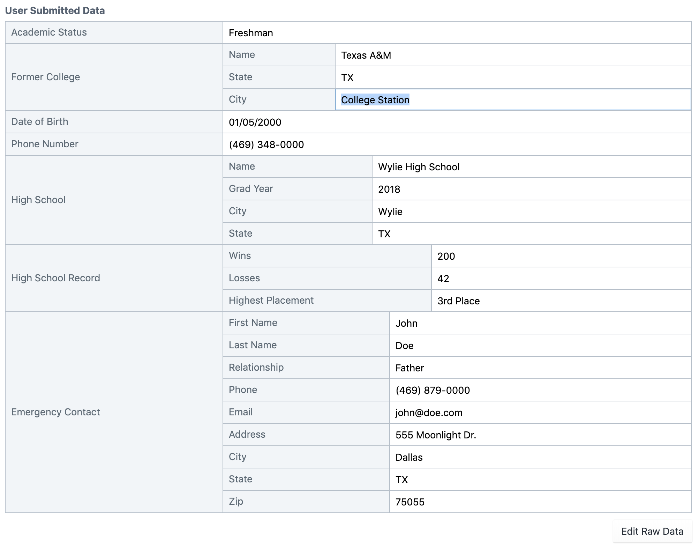
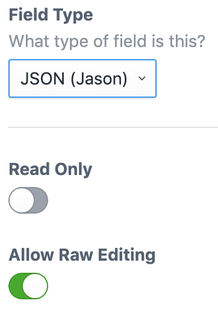

        
        <h1>Jason plugin for Craft CMS 3</h1>

A field type for displaying & editing JSON data.

## Requirements

This plugin requires Craft CMS 3.0 or later.

## Installation

To install the plugin, follow these instructions.

1.  Open your terminal and go to your Craft project:

        cd /path/to/project

2.  Then tell Composer to load the plugin:

        composer require chasegiunta/craft-jason

3.  In the Control Panel, go to Settings → Plugins and click the “Install” button for Jason.

## Jason Overview

Jason is a fieldtype tailored for displaying JSON data, typically collected from a frontend form.

## Using Jason

Jason fields can be set to readonly, allow value-only editing, or allow full editing of data (when editing keys or reordering is necessary).

Values can be accessed in templates like normal, but unless keys are in `camelCase`, you'll need to use array syntax eg. `{{ entry.myJasonField.some.nested["super key"] }}`

## Jason Roadmap

Some things to do, and ideas for potential features:

- Syntax highlighting while editing raw data
- Editable keys within control panel

Brought to you by [Chase Giunta](https://chasegiunta.com)
